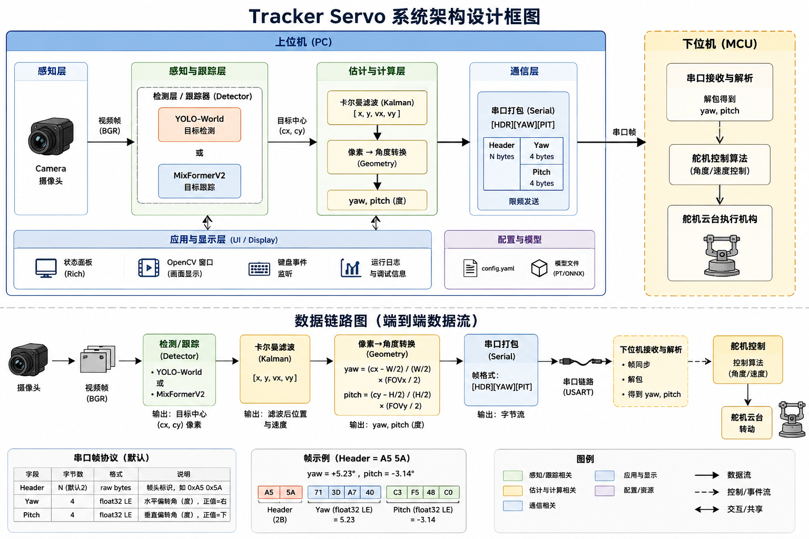

# Tracker Servo

基于视觉目标跟踪的舵机云台上位机控制程序。通过摄像头实时检测/跟踪目标，计算目标相对画面中心的偏转角（yaw/pitch），经串口发送至下位机驱动舵机云台，实现自动追踪。

## 架构设计



> 详细设计文档见 [design/DESIGN.md](design/DESIGN.md)

## 功能

- 支持两种检测/跟踪模式：
  - **YOLO-World**：基于开放词汇目标检测，按类别锁定目标
  - **MixFormerV2**：基于 ONNX 的单目标跟踪，框选即跟踪
- 卡尔曼滤波平滑目标位置，丢失时纯预测保持跟踪
- 像素偏移到角度的实时转换（基于相机 FOV）
- 串口通信，以固定帧格式 `[Header][Yaw_f32][Pitch_f32]` 发送控制指令
- Rich 终端实时状态面板 + OpenCV 可视化窗口
- 检测与控制双线程解耦，互不阻塞

## 环境要求

- Python >= 3.10
- [uv](https://github.com/astral-sh/uv)（推荐）或 pip

## 快速开始

### 1. 克隆仓库

```bash
git clone https://github.com/<your-username>/tracker_servo.git
cd tracker_servo
```

### 2. 安装依赖

使用 uv（推荐）：

```bash
uv sync
```

或使用 pip：

```bash
pip install -e .
```

> 注意：依赖中包含 [OpenAI CLIP](https://github.com/openai/CLIP.git)，需要能访问 GitHub。

### 3. 准备模型

确保 `models/` 目录下存在以下文件：

| 文件 | 说明 |
|------|------|
| `yolov8s-worldv2.pt` | YOLO-World 检测模型 |
| `mixformerv2.onnx` | MixFormerV2 跟踪模型 |
| `mixformerv2.onnx.data` | ONNX 外部数据 |

### 4. 配置

编辑 `config.yaml`：

```yaml
camera:
  source: 0          # 摄像头编号
  width: 640
  height: 480

detector:
  mode: mix          # yolo 或 mix
  yolo_model_path: models/yolov8s-worldv2.pt
  mix_model_path: models/mixformerv2.onnx
  classes:
    - person         # YOLO 模式下的检测类别
  conf: 0.5
  draw: true

tracker:
  fov_x: 60.0       # 摄像头水平视场角（度）
  fov_y: 45.0       # 摄像头垂直视场角（度）
  max_lost: 10      # 最大丢失帧数
  hz: 30            # 控制循环频率

serial:
  enabled: false     # 是否启用串口
  port: /dev/tty.usbmodem5B140645891
  baud_rate: 115200
  header: "A55A"     # 帧头（hex）
```

### 5. 运行

```bash
uv run python script/main.py
```

或已安装到环境中时：

```bash
python script/main.py
```

### 6. 操作

- **YOLO 模式**：启动后自动检测，终端列出目标列表，输入编号选择跟踪目标
- **Mix 模式**：启动后弹出窗口，用鼠标框选要跟踪的目标，按回车确认
- 运行中按 `q` 退出，按 `d` 切换画面绘制

## 串口协议

| 字段 | 长度 | 说明 |
|------|------|------|
| Header | 由配置决定（默认 2B） | 帧头标识 |
| Yaw | 4B | float32 小端，水平偏转角（度） |
| Pitch | 4B | float32 小端，垂直偏转角（度） |

## 项目结构

```
tracker_servo/
├── config.yaml          # 配置文件
├── models/              # 模型文件
├── script/
│   └── main.py          # 主入口
└── src/
    ├── cam/             # 摄像头采集
    ├── detector/        # 目标检测/跟踪后端
    ├── tracker/         # 卡尔曼滤波 + 角度计算
    ├── kie_serial/      # 串口通信
    └── ui/              # 显示模块
```
