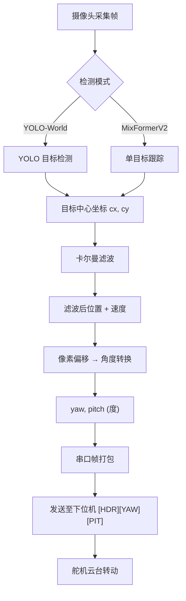
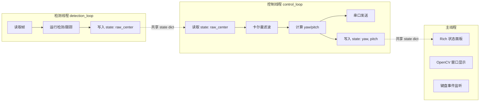
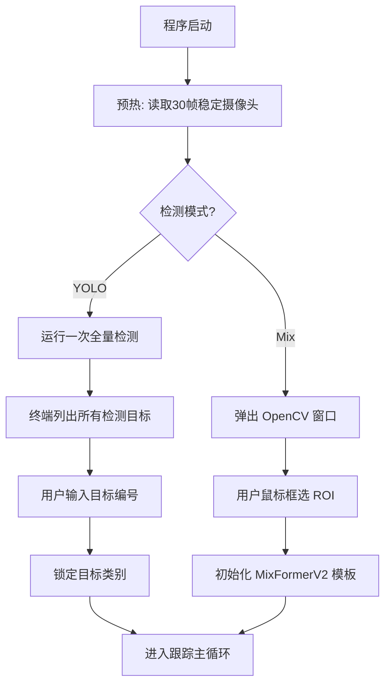

# Tracker Servo 系统设计文档

## 1. 系统架构总览

```
┌─────────────────────────────────────────────────────────────────┐
│                        上位机 (PC)                               │
│                                                                 │
│  ┌──────────┐   ┌──────────┐   ┌──────────┐   ┌────────────┐  │
│  │  Camera  │──▶│ Detector │──▶│ Tracker  │──▶│   Serial   │──────▶ 下位机
│  └──────────┘   └──────────┘   └──────────┘   └────────────┘  │
│                                                                 │
│  ┌──────────────────────────────────────────────────────────┐  │
│  │                     UI / Display                          │  │
│  └──────────────────────────────────────────────────────────┘  │
└─────────────────────────────────────────────────────────────────┘
```

## 2. 数据链路流程框图

### 2.1 主数据流



### 2.2 线程模型



### 2.3 目标选择流程



## 3. 完整项目结构

```
tracker_servo/
├── design/
│   └── DESIGN.md              ← 本文档
├── models/
│   ├── yolov8s-worldv2.pt     # YOLO-World 检测模型权重
│   ├── mixformerv2.onnx       # MixFormerV2 ONNX 模型
│   └── mixformerv2.onnx.data  # ONNX 外部权重数据
├── script/
│   └── main.py                # 主入口，线程调度与 UI
├── src/
│   ├── cam/
│   │   ├── __init__.py
│   │   └── camera.py          # 摄像头封装 (OpenCV VideoCapture)
│   ├── detector/
│   │   ├── __init__.py
│   │   ├── detector.py        # 检测器门面，统一接口
│   │   ├── yolo_backend.py    # YOLO-World 后端 (ultralytics)
│   │   └── mix_backend.py     # MixFormerV2 后端 (ONNX Runtime)
│   ├── tracker/
│   │   ├── __init__.py
│   │   ├── tracker.py         # 跟踪控制器：卡尔曼 + 角度计算
│   │   ├── kalman.py          # 4维卡尔曼滤波器 [x, y, vx, vy]
│   │   └── geometry.py        # 像素→角度几何转换
│   ├── kie_serial/
│   │   ├── __init__.py
│   │   └── serial.py          # 串口通信 (pyserial)
│   └── ui/
│       ├── __init__.py
│       └── display.py         # OpenCV 窗口显示
├── config.yaml                # 运行配置
├── pyproject.toml             # 项目元数据与依赖
├── uv.lock                    # 依赖锁文件
└── README.md                  # 使用说明
```

## 4. 模块接口设计

### 4.1 Camera

```python
class Camera:
    def __init__(self, source: int, width: int, height: int)
    def read(self) -> np.ndarray        # 返回 BGR 帧
    def release(self)                    # 释放资源
```

### 4.2 Detector

```python
class Detector:
    mode: str                            # "yolo" | "mix"
    draw_enabled: bool
    img_draw: np.ndarray | None          # 带标注的画面

    def warm_up(self, frame) -> list[dict] | None   # 预热/目标选择
    def confirm_target(self, target)                 # 确认跟踪目标
    def detect(self, frame) -> tuple[float, float] | None  # 返回目标中心
```

### 4.3 Tracker

```python
class Tracker:
    filtered_pos: tuple[float, float] | None
    filtered_state: tuple[float, float, float, float] | None  # x, y, vx, vy

    def update(self, center) -> tuple[float, float] | None  # 返回 (yaw, pitch)
    def draw(self, draw_enabled, img) -> np.ndarray | None
    def reset(self)
```

### 4.4 Kalman

```python
class Kalman:
    def init(self, x: float, y: float)       # 初始化状态
    def update(self, x: float, y: float)     # 观测更新 (predict + correct)
    def fuse(self) -> tuple[x, y, vx, vy]   # 获取当前估计状态
    def reset(self)
```

**状态模型**：

```
状态向量: X = [x, y, vx, vy]ᵀ
状态转移: F = [[1, 0, dt, 0],
               [0, 1, 0, dt],
               [0, 0, 1,  0],
               [0, 0, 0,  1]]
观测矩阵: H = [[1, 0, 0, 0],
               [0, 1, 0, 0]]
```

### 4.5 Geometry

```python
def solve_yaw_pitch(cx, cy, frame_width, frame_height, fov_x, fov_y)
    -> (yaw, pitch)
```

**计算公式**：

```
yaw   = (cx - W/2) / (W/2) × (FOV_x / 2)
pitch = (cy - H/2) / (H/2) × (FOV_y / 2)
```

### 4.6 Serial

```python
class Serial:
    def send(self, yaw: float, pitch: float)   # 限频发送
    def close(self)
```

## 5. 串口协议详细设计

### 帧结构

```
┌────────────┬─────────────┬──────────────┐
│   Header   │    Yaw      │    Pitch     │
│  (N bytes) │  (4 bytes)  │  (4 bytes)   │
└────────────┴─────────────┴──────────────┘
```

| 字段 | 字节数 | 格式 | 说明 |
|------|--------|------|------|
| Header | 可配置 (默认 2B: `0xA5 0x5A`) | raw bytes | 帧头标识，用于下位机帧同步 |
| Yaw | 4 | float32 LE | 水平偏转角（度），正值=目标在右 |
| Pitch | 4 | float32 LE | 垂直偏转角（度），正值=目标在下 |

### 示例

目标在画面右上方，yaw=+5.23°，pitch=-3.14°：

```
A5 5A 71 3D A7 40 C3 F5 48 C0
│  │  │           │
│  │  └─ yaw bytes (LE float32 = 5.23)
│  │              └─ pitch bytes (LE float32 = -3.14)
└──└─ header
```

## 6. 数据流时序

```
时间 ──────────────────────────────────────────────────▶

检测线程:  [读帧][检测]---[读帧][检测]---[读帧][检测]---
              │              │              │
              ▼              ▼              ▼
共享状态:  raw_center    raw_center    raw_center
              │              │              │
控制线程:  ───[KF][角度][串口]───[KF][角度][串口]───[KF预测][串口]───
              │                   │                   │
              ▼                   ▼                   ▼
下位机:    ←─frame─────────←─frame─────────←─frame──────────
```

- 检测线程不限频，尽可能快地产出检测结果
- 控制线程以固定频率运行（默认 30Hz），无新检测时使用卡尔曼纯预测
- 串口发送内置限频，避免淹没下位机

## 7. 配置参数说明

| 参数 | 默认值 | 说明 |
|------|--------|------|
| `camera.source` | 0 | 摄像头设备编号 |
| `camera.width/height` | 640×480 | 采集分辨率 |
| `detector.mode` | mix | 检测模式：`yolo` 或 `mix` |
| `detector.conf` | 0.5 | YOLO 置信度阈值 |
| `tracker.fov_x/fov_y` | 60°/45° | 摄像头视场角 |
| `tracker.max_lost` | 10 | 允许最大丢失帧数，超过则重置 |
| `tracker.hz` | 30 | 控制循环频率 |
| `serial.enabled` | false | 是否启用串口 |
| `serial.header` | "A55A" | 帧头 (hex 字符串) |
| `serial.baud_rate` | 115200 | 波特率 |
